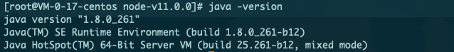

title: "Centos7 安装 JDK1.8"
date: 2019-07-28 10:48:16
categories: 环境配置
tags: [java,centos7]

---

### 安装前准备

1. 打开Oracle java：[官方地址](https://www.oracle.com/java/technologies/javase/javase-jdk8-downloads.html)

2. 选择linux版本的文件下载。ps：很操蛋的是需要登录，而且登录经常有问题。

   提供一个百度网盘下载地址：链接:https://pan.baidu.com/s/1ke_SE1cfFeH_74K5iZnbvw  密码:uyp4

3. 通过ftp上传到对应服务器；ps：我尝试了下最新版的官网无法wget了，不知道是本人太菜了还是咋的。

###  开始安装

1. 创建安装目录

   ```shell mkdir /usr/local/java
    mkdir /usr/local/java
   ```

2. 进入你上传的目录后进行解压到上一步创建的目录中

   ```shell
   tar -zxvf jdk-8u261-linux-i586.tar.gz -C /usr/local/java
   ```

3. 设置环境变量

   1. 打开文件

   ```shell
   vim /etc/profile
   ```

   2. 在文件末尾添加 (**java目录地址自行更改**)

   ``` shell 
   export JAVA_HOME=/usr/local/java/jdk1.8.0_261
   export JRE_HOME=${JAVA_HOME}/jre
   export CLASSPATH=.:${JAVA_HOME}/lib:${JRE_HOME}/lib
   export PATH=${JAVA_HOME}/bin:$PATH
   ```

   3. 使添加的环境变量生效

   ```shell
   source /etc/profile
   ```

   4. 添加软链接 (**java目录地址自行更改**)

   ``` shell
   ln -s /usr/local/java/jdk1.8.0_261/bin/java /usr/bin/java
   ```

4. 验证

   ```shell
   java -version
   ```

   

参考文章: [CentOS 7 安装 JAVA环境（JDK1.8）](https://www.cnblogs.com/stulzq/p/9286878.html)

