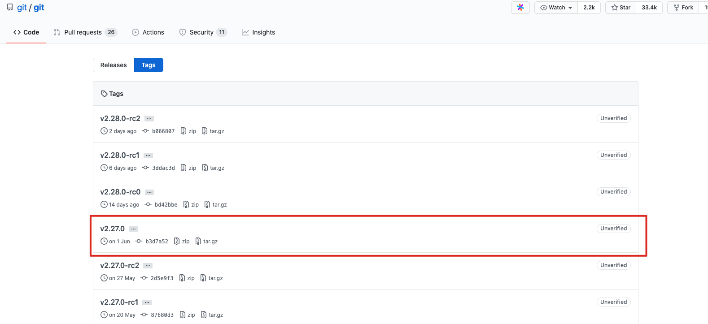

title: "Centos7 安装git"
date: 2019-07-28 10:48:16
categories: 环境配置
tags: [git,centos7]

---

### 安装前准备

1. 确认是否包含git

```shell
git version
```

2. 如果存在移除

``` shell
yum remove git
```

### 为何不使用yum安装git？

使用yum安装很简单，**但是yum安装的git版本目前在我安装时为1.8版本相较于最新的有一定的差距，为了追求最新的所以不选择yum安装git。**

下面为yum安装方法：

```shell
yum update
yum install git
```

### 必要的依赖库安装

```shell
yum install curl-devel expat-devel gettext-devel openssl-devel zlib-devel
yum install  gcc perl-ExtUtils-MakeMaker
```

### 开始安装

1. 从github上获取最新下载地址: [git下载地址列表](https://github.com/git/git/tags)



2. 选择好最新版本获取下载链接后：

```shell
wget https://github.com/git/git/archive/v2.27.0.tar.gz
```

3. 创建安装目录

```shell
mkdir /usr/local/git
```

4. 解压到安装目录

```shell
tar -zxvf v2.27.0.tar.gz -C /usr/local/git
```

5. 安装git

```shell
make prefix=/usr/local/git all
make prefix=/usr/local/git install
```

6. 验证

```shell
git version
```


