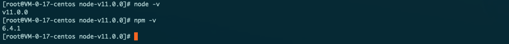

title: "Centos7 安装node"
date: 2019-07-28 10:48:16
categories: 环境配置
tags: [node,centos7]

---

### 安装前准备

​	git环境配置：x x x x

### 安装

1. 下载安装包（其他版本自己访问https://npm.taobao.org/mirrors/node）ps: 其他版本编译的时候可能报错

```shell
wget https://npm.taobao.org/mirrors/node/v11.0.0/node-v11.0.0.tar.gz
```

2. 创建安装目录

```shell
mkdir /usr/local/node
```

3. 解压到安装目录并进入安装目录

``` shell
tar -zxvf node-v11.0.0.tar.gz -C /usr/local/node
cd /usr/local/node/node-v11.0.0
```

4. 进行编译（编译时间大约30分钟哟）

``` shell
./configure && make
```

5. 安装

```shell
make install
```

6. 验证环境

```shell
node -v
npm -v
```



7. 选择性安装cnpm（可加快下载速度）

``` shell
npm install -g cnpm --registry https://registry.npm.taobao.org
```

