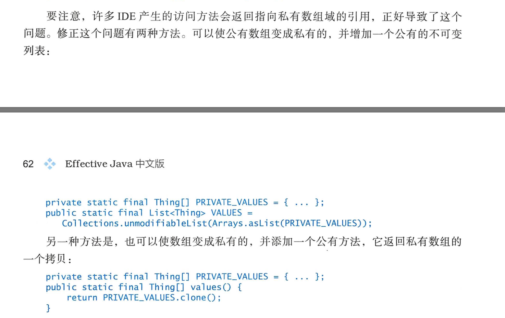

1. 不要用singleton和静态工具类爱实现依赖一个或者多个底层资源的类，且该资源的行为会影响该类的行为。也不要用这个类来创建这些资源。而应该将这些资源或者工厂传给构造器（或静态工厂，或者构建器），通过他们来创建类。这个实践叫做依赖注入。*比如：一个拼写检查器需要一个词典，而不止一个词典，就应该通过依赖注入传入，而不应该使用静态或者单例来实现。*
2. 内存泄漏
   1. 只要类是自己管理内存（比如自己实现的栈），就应该警惕内存泄漏问题，一旦元素被释放掉，则该元素中包含的任何对象运用都应该被清空
   2. 内存泄漏另一个来源就是缓存，可以使用WeakHashMap来代替缓存，但前提是缓存的生命周期由该键的外部引用所决定而不是值。
   3. 监听器或者其他回调：最好的办法是使用WeakHashMap，例如只将他们保存成WeakHashMap的键
3. 避免使用终结方法
   1. 性能问题
   2. 安全问题
4. try-with-resource 优先于 try-finally: 因为try-finally中最后资源的关闭也有可能报错。
5. 不对外暴露api就把类设为包级私有（缺省 default），本包有其他类 这些类只是辅助包里面的公有类。如果将其作为公有的你需要随时随地支持它。
6. 如果一个包级私有的顶层类只是在某一个类的内部被用到，就应该考虑使它成为使用它的那个类的私有嵌套类。
7. 公有类中实例域不能是公有的，只有一种情况例外，假设常量构成了类提供的整个抽象中的一部分，可以通过公有域的静态final解决，用大写字母组成，要么为基本类型，要么指向不可变对象。**解决数组为公有类中实例域的方法**
8. **坚决不要给每个get方法编写一个set方法，除非有很好的理由让类变为可变类，否则他就应该为不可变的。不可变的唯一缺点就是可能会出现性能问题** 
9. **除非有让人信服的理由要让域变成非final的，否则要是每个域都是private final的**
10. 如果类不能被做成不可变的，仍然应该限制他的可变性。 


第32条需要重新看。


##  专业术语

1. 域：字段

2. 样板代码： 不同类型的实现在一个类但却有着两种不同的实现方式。

3. 标签类： enum中实现不同的类型的逻辑

4. 静态成员类：可以在外围实例之外单独存在

5. 非静态成员类的弊端：在没有外围实例的情况下，不可能被创建；每个实例都会包含一个额外的指向外围对象的引用。**保存这份引用要消耗时间和空间且会导致当外围类实例符合垃圾回收时却仍然可以保留。由此可能导致内存泄露。而且常常难以发现，因为这个引用是不可见得的**

6. PECS：泛型->参数化类型表示一个生产者用`<? extends T>,表示一个消费者用<? super T>`；所有的comparable和compartor都是消费者`<? extends Comparable<? super T>>`

7. 容器参数化：Set<T> ,Map<K,V>等的用法就是参数化了这些容器；

8. 键参数化：通过将类型参数放在键上而不是容器上可以避开容器只能有固定的类型参数的限制。而且该方式是类型安全的异构容器，可以用Class对象作为键，这种方式叫做类型令牌。也可以使用定制的键类型。如：一个DatabaseRow类型表示一个数据库行容器，用Column<T>作为他的键

   ```
   Public class Favorites {
   	private Map<Class<?>, Object> favorites = new HashMap<>();
   	
   	public <T> void putFavorite(Class<T> type, T instance) {
   		favorites.put(Objects.requireNonNull(type), type.cast(instance);
   	}
   	
   	public <T> T getFavorite(Class<T> type) {
   		 return type.cast(favorites.get(type));
   	}
   }
   ```

9. int 枚举模式：通常是一组int常量来表示枚举类型，每个int常量代表一个成员

   ```java
   public static final int APPLE1 = 1;
   public static final int APPLE1 = 2;
   public static final int APPLE1 = 3;
   ```

10. 位域：用OR 运算符将几个常量合并到一个集合中，称作位域

11. 使用TheardLocalRandom
