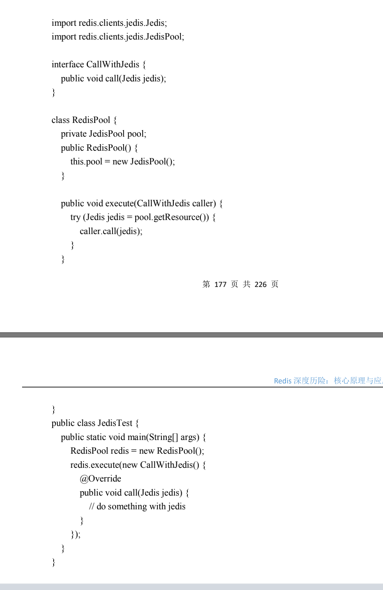
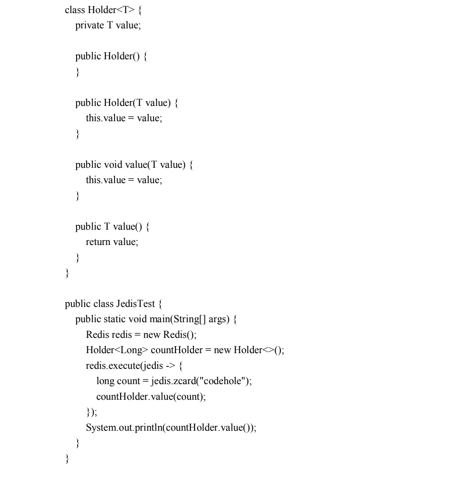

title: "redis基础"
date: 2020-04-03 10:48:16
categories: redis
tags: [redis]

----

1. redis基础数据结构

   1. string
   2. list
   3. hash
   4. set
   5. zset

2. 分布式锁的解决方案

   1. 一般使用setnx指令，只允许一个客户端占用，在调用del指令：问题在于如果逻辑异常可能到你del指令不会被调用导致死锁。所以加上一个过期时间，即使出现异常可以保证自动释放。redis2.8后增加了扩展参数。使setnx与exire组合起来成为原子指令。
   2. 超时问题：当加锁和释放锁之间超过了逻辑执行时间则会自动释放，然后第二个线程持有锁。尽量不要用于较长时间的任务。更加安全的方式是value设置随机数，删除时先匹配是否一致，保证是同一个客户端同一个线程才能删除该key
   3. 可以设置守护线程增加redis的过期时间
   4. 可重入性可以参考ReentrantLock使用ThreadLoacl来存储当前持有锁的数量 不推荐
   5. 公司运用场景：abb进项发票采集

3. 位图

   1. 使用场景可以是用户一年的签到记录,使用bitcount key 可以统计签到天数,使用bitpos key 0|1查看该数字从第几个开始即签到开始时间
   2. 位图就是普通的字符串，也就是byte数组
   3. 命令：setbit key offset 1|0 getbit key offset 零存零取 setbit getbit 整存零取 set. gitbit

4.  HypweLogLog 

   1. Pfadd pfcount

5. 布隆过滤器 视频推荐 url去重 邮件过滤

    已经见过的元素不会误判

6. 漏斗限流

   1. 漏斗容量 漏斗流水速率
   2. Redis-Cell限流模块使用了漏斗算法。c1.throttle key capacity operations seconds (operations/seconds = 漏水速率)

7. GeoHash

   1. 简单实现方案：矩形范围 通过数据库 select id from positions where x0-r<x<x00 and y0-r<y<y0+r
   
8. scan基础

    1. scan 0 match key99* count 1000 从第一个整数开始遍历 一直遍历到cursor值为0结束；1000代表**单次遍历的字典槽位数量（约等于）** 如果设置为10，会发现返回结果是空的，但是游标值不为0，还是要继续遍历
    
    2. 字典的结构
        1. 所有的key都存储在一个很大的字典中，跟java中hashmap一样，是一维数组+二位链表结构。一个扩容就会空间加倍。
        2. **scan指令返回的游标就是第一维数组的位置索引，这个位置索引称为槽**，不考虑字典扩容缩容，直接按数组下标挨个遍历就行了。limit参数就表示需要遍历的槽数位。所以每次扫描返回的结果可能多也可能少，因为不是所有的都会挂接链表。
        
    3. scan遍历顺序
    
        1. 采用高位进位加法遍历，因为需要考虑字典的扩容和缩容避免槽位的遍历重复和遗漏。
    
        2. 高位进位法从左边进，进位往右边移动，同普通加法正好相反。但最终会遍历所有的槽位。
    
        3. rehash 就是将元素的hash 值对数组长度进行取模运算。所以每个元素挂接的槽位可能也发生了变化。又因为数组的长度是 2^n 次方，所以取模运算等价于位与操作。
    
            1. a mod 8 = a &(8-1)=a&7
            2. a mod 16 = a&(16-1)=a&15
            3. a mod 32 = a&(32-1)=a&31
    
            这里的7(111),15(1111),31(11111)称为字典的mask值，作用是保留hash的低位，高位被设置为0。
    
        4. 假设长度为8 扩容到16 那个 3(011)号槽位的数据会被rehash到3号槽位或11号槽位。
    
        5. 抽象来说 假设槽位二进制是xxx，那么该槽位中的元素将被rehash到0xxx和1xxx(xxx+8)中。如果字典长度有16位扩容到32位，那么对于二进制槽位xxxx中的元素将被rehahs到0xxxx和1x x x x(xxxx+16)中。
    
        6. 渐进式rehash。java的hashmap在扩容时会一次性将旧数组下挂接的元素全部转移到新数组下main。如果hashmap中元素特别多，线程就会出现卡顿现象。redis为了解决这个问题采用渐进式rehash
    
9. 线程io模型 

    事件轮训（多路复用）

10. 通信协议 RESP

11. 持久化

     1. 快照

        1. 一次性全量备份 怎样保证在持久化的同时、内存数据机构还在改变的情况下实现？

           ***使用COW实现，在持久化时调用glibc函数fork产生一个子进程，快照持久化完全交给子进程处理，父进程继续处理客户端请求。子进程刚刚产生时，它和父进程共享内存里面的代码和数据段共享，所以在开启子进程时并不会增加内存消耗，只有当父进程数据发生数据改变才会将共享的页面复制一份分离出来，然后对这个复制的页面进行修改。这是子进程时没有变化的***每个一页有4k大小。

     2. AOF

        1. 只记录对内存进行修改的指令记录。随着redis长期运行aof的日志会变长，如果宕机重启整个AOF会非常耗时。
        2. aof重写

     3. rdb aof混合持久 之存放持久化开始到结束增量的aof日志，重启先加载rdb在重放aof

12. 管道 

     1. 并不是服务端提供 而是客户端提供的 避免多次网络请求
     2. **write操作将数据写到本地操作系统内核的发送缓冲就返回。剩下的交给了内核异步发送到目标机器**
     3. 本质就是改变了读写顺序

13. 事务

     1. multi incr incr ... exec
     2. 只能保证顺序执行原子性 不能保证事务原子
     3. 跟pipeline一起使用将多次io压缩为单次io

14. 主从同步

     1. CAP原理-网络分区发生时，一致性和可用性两难全

         分布式系统的节点往往分布在不同的机器上进行网络隔离，这意味着会有网络断开的风险，**这个网络断开的场景叫网络分区**。在网络分区发生时，两个分布式节点无法通信，我们对一个节点修改无法同步到另外一个节点，数据一致性将无法满足，因为分布式节点数据不在保持一致，除非牺牲可用性来暂停分布式节点，在网络分区发生时，不再提供修改数据功能，知道网络状况完全恢复在对外提供服务

     2. 最终一致性

     3. sentinel

     4. Codis-不支持事务 默认1024槽位

     5. cluster将所欲数据划分为  16384

15. 优雅使用jedis

     

     闭包里面不能被修改

     

