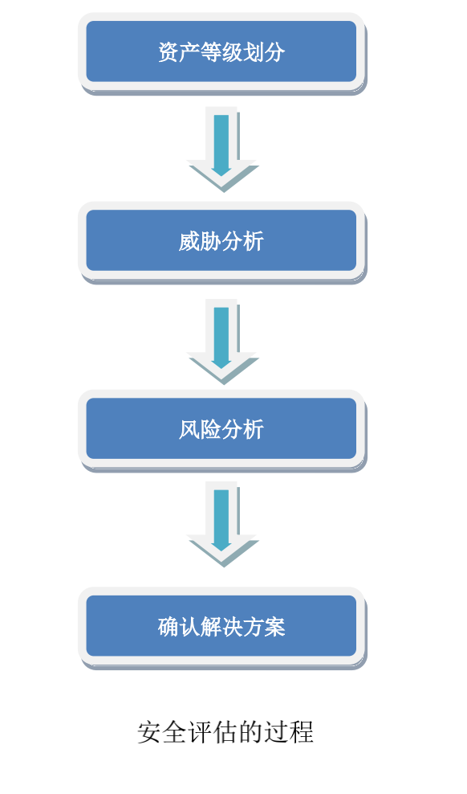

title: "白帽子讲web安全读书笔记"
date: 2020-02-11
categories: 读书笔记
tags: [web]

----

### 安全三要素

1. 机密性：要求保护数据内容不能泄漏，加密是实现机密性要求的常见手段
2. 完整性：要求被保护数据内容是完整的、没有篡改的。常见手段是**数字签名**
3. 可用性：要求保护资源是“随需而得” 拒绝服务攻击（dos）

<!-- more -->

### 如何实施安全评估

### 白帽子兵法

#### secure by default

1. 白名单、黑名单

2. 最小权限原则：比如linux用户权限

3. 纵深防御原则：

   1. 从不同层面、不同角度对系统做出整体的解决方案
   2. 正确的地方做正确的事情。比如：xss不用在用户输入时过滤，应该在输出时过滤

4. **世上没有万能灵药，也没有哪种解决方案能解决所有问题，因此非**

   **常有必要将风险分散到系统的各个层面。**

5. 数据与代码分离原则

   数据与代码分离开来，数据不能包含代码，应该过滤相应的标签。如：

6.  不可预测性原则

   不可预测性的实现往往需要用到加密算法、随机数算法、哈希算法

### 点击劫持

利用iframe透明页面的button覆盖原页面的button引诱用户点击

### flash劫持

### 图片劫持

j

### mvc框架安全

1. 最好的xss防御方案是不同的场景需要使用不用的编码函数

