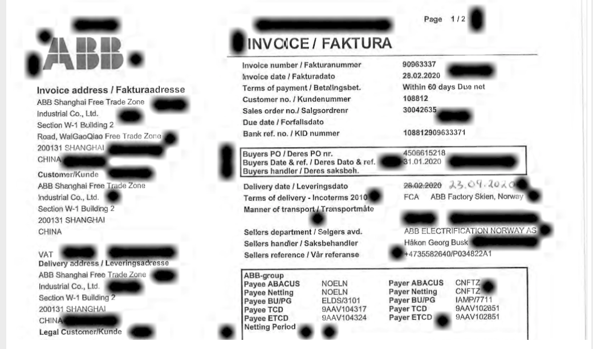

title: "使用pdfbox转换image时出现黑线问题"
date: 2019-07-28 10:48:16
categories: java
tags: [java, 错误收集]

## 

## 问题描述：

在使用pdfbox将pdf转image时在转换后的图片出现了一些粗粗的黑线，起初以为是pdfbox的bug，经过一系列的验证发现发生问题的根本原因在`jai-imageio-jpeg2000`这个jar包。

问题图如下：



<!-- more -->

使用jar包如下: 

```xml
 				<dependency>
            <groupId>org.apache.pdfbox</groupId>
            <artifactId>pdfbox</artifactId>
            <version>2.0.19</version>
        </dependency>
				 <dependency>
            <groupId>org.apache.pdfbox</groupId>
            <artifactId>fontbox</artifactId>
            <version>2.0.19</version>
        </dependency>
 				<dependency>
            <groupId>com.github.jai-imageio</groupId>
            <artifactId>jai-imageio-core</artifactId>
            <version>1.3.1</version>
        </dependency>

        <dependency>
            <groupId>com.weaveone.jai-imageio</groupId>
            <artifactId>jai-imageio-jpeg2000</artifactId>
            <version>1.3.1</version>
        </dependency>

        <!-- https://mvnrepository.com/artifact/org.apache.pdfbox/jbig2-imageio -->
        <dependency>
            <groupId>org.apache.pdfbox</groupId>
            <artifactId>jbig2-imageio</artifactId>
            <version>3.0.3</version>
        </dependency>
        <dependency>
            <groupId>com.twelvemonkeys.imageio</groupId>
            <artifactId>imageio-jpeg</artifactId>
            <version>3.4.1</version>
        </dependency>
        <dependency>
            <groupId>com.github.jai-imageio</groupId>
            <artifactId>jai-imageio-jpeg2000</artifactId>
            <version>1.3.0</version>
        </dependency>
```

## 问题解决

在网上搜索了就终于在stackoverflow上面找到了一个答案

https://stackoverflow.com/questions/41977536/black-stain-when-extracting-page-to-image-on-pdfbox-2-0-4

通过上面的解决方法，我修改了一个image2000的源码：

https://github.com/WeaveOwn/jai-imageio-jpeg2000.git

将上面的源码clone下来进行后打成jar引入即可解决问题