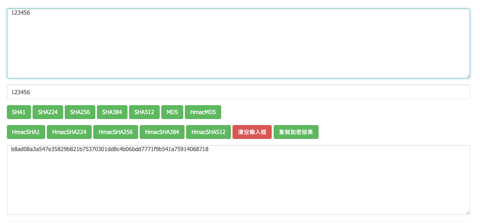

title: "关于SHA256等加密及其Base64编码"
date: 2020-07-22 18:12:16
categories: 问题记录
tags: [加密,java]

----

## 前言

最近跟其他公司进行接口对接时出现了一个关于加密及其编码问题。由于我们公司采用的是oauth1.0的方式进行接口的认证。里面就涉及到hmac-sha256的加密，然后进行base64编码后进行传输。

## 问题

HMAC-SHA256：两部分组成

	1. 需要加密的字符串
 	2. 加密的密钥

由于该公司使用的是非java语言，所以才用的加密的方式可能不相同，该公司加密返回的是一个字符串，而使用java自带的返回的是byte数组。就因为这个一点不一样导致了最后用base64出来的字符串不一样，从而导致验签失败。而我找到的HMAC-SHA256加密的网站返回也是字符串。

## 解决

找到不同后，通过分析发现返回的字符串`b8ad08a3a547e35829b821b75370301dd8c4b06bdd7771f9b541a75914068718`为16进制的字符串

如果直接通过字符串的getBytes() 方法得到的二进制数组在进行base64编码就会有问题（网上的base64编码跟getBytes是一样的，都是当作字符串进行编码而不是当作16进制字符串）。因为对于16进制的字符串它的2位对应着一个byte。而直接通过getBytes() 获取的却是1位字符对应一个byte，从而导致问题出现。解决问题只需要将16进制的字符串转为2进制，然后在进行base64编码即可。