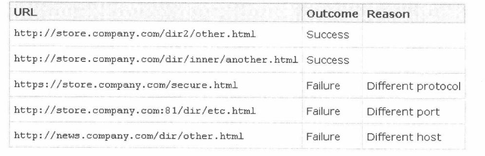
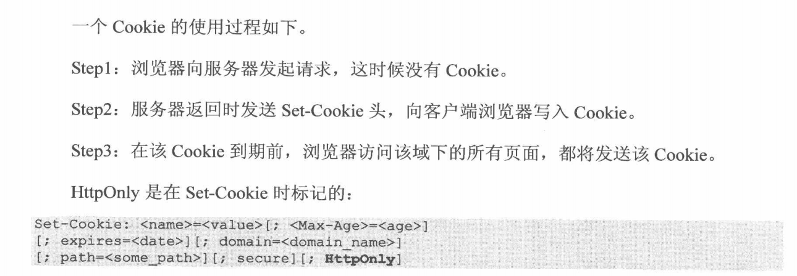

title: "白帽子讲web安全读书笔记"
date: 2020-02-11
categories: 读书笔记
tags: [web]

----

### 安全三要素

1. 机密性：要求保护数据内容不能泄漏，加密是实现机密性要求的常见手段
2. 完整性：要求被保护数据内容是完整的、没有篡改的。常见手段是**数字签名**
3. 可用性：要求保护资源是“随需而得” 拒绝服务攻击（dos）

<!-- more -->

### 如何实施安全评估

### 白帽子兵法

#### secure by default

1. 白名单、黑名单

2. 最小权限原则：比如linux用户权限

3. 纵深防御原则：

   1. 从不同层面、不同角度对系统做出整体的解决方案
   2. 正确的地方做正确的事情。比如：xss不用在用户输入时过滤，应该在输出时过滤

4. **世上没有万能灵药，也没有哪种解决方案能解决所有问题，因此非**

   **常有必要将风险分散到系统的各个层面。**

5. 数据与代码分离原则

   数据与代码分离开来，数据不能包含代码，应该过滤相应的标签。如：\

6.  不可预测性原则

   不可预测性的实现往往需要用到加密算法、随机数算法、哈希算法 

### 浏览器安全

#### 同源策略

​	浏览器的同源策略，限制了来自不同源“document”或脚本，对当前“document”读取或设置某些属性。

​	上表可以看出，影响“源”的因素有：host（域名或ip地址，如果ip地址则看作一个根域名）、子域名、端口、协议。

 **ps：页面内存放JavaScript文件的域并不重要，重要的是加载JavaScript的所在的域。**

script标签仅能加载资源，不能读、写资源的内容

#### 浏览器沙箱

sanbox

### 跨站脚本攻击（xss）

​	xss攻击，通常指黑客通过“HTML注入”篡改了网页，插入了恶意的脚本，从而在用用户浏览网页时，控制用户浏览器的一种攻击。**本质就是HTML注入**

#### xss钓鱼

通过构造假的登录框等进行窃取密码

#### XSS防御

1. HttpOnly 解决的事XSS后的Cookie劫持攻击。如果设置了JavaScript将读取不到cookie的值

   

   服务器可能会设置多个cookie（多个key-value对），而httponly可以有选择性地夹在任何一个cookie值上。在某些时候，应用可能需要JavaScript访问某几项cookie，这样可以不设置httponly标记；而仅把httponly标记给用于认证的关键cookie

2. 输入检查：比如手机号、姓名、邮箱检查，前端和后端都需要进行检查

3. 输出检查，除了富文本的输出外，都可以失忆哦那个编码或者转义的方式

4. 安全的编码函数：针对html代码的编码方式是HtmlEncode

#### 正确防御xss

​	xss的本质是一种**HTML注入**，用户的数据被当成html代码一部分来执行，从而混淆了原本的寓意，产生新的语意。在用户提交数据处进行输入检查的方案，其实并不是真正发生攻击的地方做防御。

​	想要根治xss问题，可以列出所有xss可能发生的场景，再一一解决。

输出位置：

1. html标签中输出或html属性中输出：防御方法采用HtmlEncode。
2. \<script>标签中输出：防御时使用JavaScriptEncode。
3. 在事件中输出：与上面类似：防御时需要使用JavaScriptEncode。
4. 尽可能禁止用户可控制的变量在“\<style>标签”、“HTML标签的style属性”以及“CSS文件”中输出。如果一定需要推荐个OWASP ESAPI中的encodeForCSS()函数。
5. 在地址中输出：防御方式采用URLEncode。
6. 处理富文本：使用白名单
7. 防御dom based xss 输入时使用JavaScriptEncode，如果输出到html在使用HtmlEncode，事件或者脚本使用JavaScriptEncode。

### 跨站点请求伪造（CSRF）

#### CSRF的防御

1. 验证码
2. Referer Check 最常用的应用就是“防止图片盗链”
3. 最好的做法是使用一个Token。

### 点击劫持

利用iframe透明页面的button覆盖原页面的button引诱用户点击

### flash劫持

### 图片劫持

**防御ClickJacking一般是通过禁止跨域的iframe来防范**

### HTML5安全

### mvc框架安全

1. 最好的xss防御方案是不同的场景需要使用不用的编码函数

