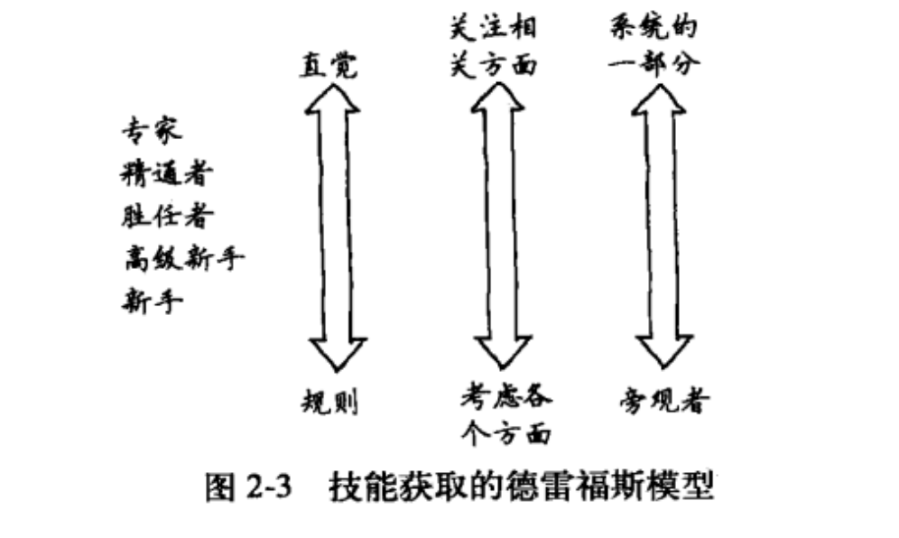
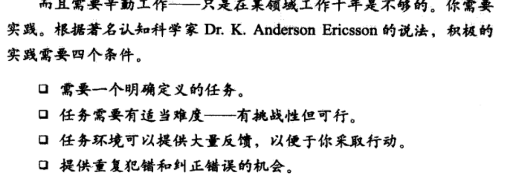

title: "程序员的思维修炼读书笔记"
date: 2020-02-11
categories: 读书笔记
tags: [思维]

----

### 从新手到专家的历程：

1. 重要的三个变化
   1. 从依赖规则向依赖直觉转变
   2. **观念的改变，问题已不再是一个相关度等同的所有单元的集合，而是一个完整和独特的整体，其中只有某些单元是相关的**
   3. 从问题的旁观者转变为问题涉及的系统本身的一部分
   4. 

<!-- more -->

2. 

